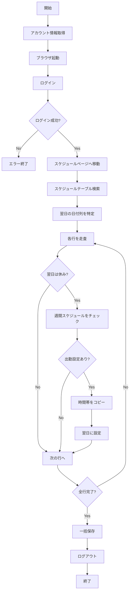

# 自動スケジュール更新機能

## 概要

A. スケジュール自動更新: 毎日AM7:00〜10:00に実行。週間スケジュールに基づき、翌日の設定を「出勤設定」に変更し登録する。

## 機能説明

### 処理ロジック

1. **ログイン処理**
   - 126個のアカウントに順次ログイン
   - 保存されているlogin_url（doors1またはdoors2）を使用

2. **スケジュールページへ移動**
   - カシュテ/キャスト管理ページへ自動遷移

3. **翌日の出勤設定**
   - 翌日の日付列を特定
   - 各行（キャスト）について：
     - 翌日が「休み」の場合
     - その行の週間スケジュールに「出勤」設定があるか確認
     - ある場合、その時間帯を翌日にコピー
     - 「出勤設定」として登録

4. **保存とログアウト**
   - スケジュール変更を一括登録
   - アカウントからログアウト

## スクリプト

### テスト用スクリプト

**ファイル**: `backend/scripts/auto_schedule_attendance.py`

**使用方法**:

```bash
cd backend
python scripts/auto_schedule_attendance.py
```

**テストアカウント**:
- ID: `inpon_hmm`
- PASS: `3F6KwLSdEe`

### 実装内容

```python
# 主要な関数

1. try_login(page, url, username, password)
   - Playwrightでログイン処理

2. navigate_to_schedule_page(page, username)
   - スケジュール管理ページへ移動

3. get_tomorrow_date_string()
   - 翌日の日付を日本語形式で取得
   - 例: "2/4(水)"

4. process_schedule_attendance(page, username)
   - スケジュール処理のメインロジック
   - 翌日列を特定
   - 各行の「休み」をチェック
   - 出勤時間があればコピー
   - 変更を適用

5. process_single_account(username, password, login_url)
   - 1アカウントの完全処理
   - ログイン→処理→ログアウト
```

## 処理フロー



## スケジュール自動実行

### Cron設定（Linux/Mac）

```bash
# 毎日午前7時に実行
0 7 * * * cd /path/to/backend && python scripts/auto_schedule_attendance.py >> logs/schedule_auto.log 2>&1
```

### タスクスケジューラー（Windows）

1. タスクスケジューラーを開く
2. 「基本タスクの作成」を選択
3. 設定:
   - **トリガー**: 毎日 7:00 AM
   - **操作**: プログラムの開始
   - **プログラム**: `python`
   - **引数**: `scripts/auto_schedule_attendance.py`
   - **開始**: `C:\Users\Administrator\Documents\200 account automation\backend`

## 全アカウント対応版

テストが成功したら、全126アカウントを処理する版を作成:

```python
def main_all_accounts():
    """Process all 126 accounts"""
    from bulk_login_and_extract import get_accounts_ordered
    
    accounts = get_accounts_ordered()
    
    results = {
        'success': 0,
        'failed': 0,
        'total_attendance_set': 0
    }
    
    for i, account in enumerate(accounts, 1):
        print(f"\n[{i}/{len(accounts)}] Processing: {account.username}")
        
        # Decrypt password
        plain_password = decrypt_password(account.password_encrypted)
        
        # Process
        result = process_single_account(
            account.username,
            plain_password,
            account.login_url or LOGIN_URLS[1]
        )
        
        if result['success']:
            results['success'] += 1
            if result['stats']:
                results['total_attendance_set'] += result['stats']['attendance_set']
        else:
            results['failed'] += 1
        
        # Rate limiting
        time.sleep(2)
    
    return results
```

## 注意事項

### 1. UI要素の特定

スケジュールページのUI構造によって、以下の調整が必要な場合があります：

- **スケジュールタブの名前**: "カシュテ"、"カシ"、"キャスト" など
- **テーブル構造**: 日付の位置、列の数
- **編集モード**: クリック後の入力方法
- **保存ボタン**: "一括登録"、"保存"、"更新" など

### 2. エラーハンドリング

- ログイン失敗時の再試行
- スケジュールページが見つからない場合
- 翌日の列が見つからない場合
- 保存エラー時の対応

### 3. ログ記録

すべての操作は `backend/logs/` に記録されます：

```python
logger.info(f"[{username}] Processing schedule for tomorrow: {tomorrow_str}")
logger.info(f"[{username}] Found {cells_to_update} cells to update")
```

## テスト手順

### 1. 単一アカウントテスト

```bash
cd backend
python scripts/auto_schedule_attendance.py
```

**確認項目**:
- ✓ ログインが成功するか
- ✓ スケジュールページに移動できるか
- ✓ 翌日の列を正しく特定できるか
- ✓ 「休み」のセルを検出できるか
- ✓ 出勤時間をコピーできるか
- ✓ 変更が保存されるか

### 2. 複数アカウントテスト

最初の5アカウントでテスト:

```python
accounts = get_accounts_ordered()[:5]  # First 5 only
```

### 3. 本番実行

全126アカウントで実行:

```bash
python scripts/auto_schedule_attendance_all.py
```

## トラブルシューティング

### Q1: スケジュールページが見つからない

**対策**:
- ブラウザを可視モード(`headless=False`)で実行
- ページのHTML構造を確認
- セレクタを調整

```python
# デバッグ用: ページのHTMLを保存
page.content() を確認
```

### Q2: 翌日の列が特定できない

**対策**:
- 日付フォーマットを確認: "2/4(水)" vs "2/4" vs "2月4日"
- ヘッダーのテキストをログ出力して確認

```python
headers = page.query_selector_all('th')
for h in headers:
    print(h.inner_text())
```

### Q3: セルのクリック・編集ができない

**対策**:
- クリック後の待機時間を調整
- 編集UIの構造を確認（ポップアップ、インライン編集など）
- JavaScript評価で直接値を設定

### Q4: 保存ボタンが見つからない

**対策**:
- ボタンのテキストを確認
- セレクタを追加・調整
- キーボード操作を試す（Enter、Ctrl+S など）

## 今後の拡張

### 1. バッチ処理の最適化

- 複数アカウントの並列処理
- 失敗したアカウントの自動リトライ

### 2. 通知機能

- 処理完了時のメール通知
- エラー発生時のアラート

### 3. レポート生成

- 日次の処理サマリー
- 変更内容の詳細レポート

### 4. UI統合

- フロントエンドからの手動実行
- リアルタイム進捗表示

## まとめ

✅ **完成項目**:
- 単一アカウント用テストスクリプト
- ログイン処理
- スケジュールページナビゲーション
- 翌日の日付特定
- 休みから出勤への変更ロジック
- ログアウト処理

🔧 **要調整項目**:
- UI要素のセレクタ（実際のページ構造に合わせて）
- 編集モードの操作方法
- 保存ボタンの特定

📋 **次のステップ**:
1. テストアカウントで実行・検証
2. UI要素の調整
3. 全アカウント対応版の作成
4. スケジュール自動実行の設定
